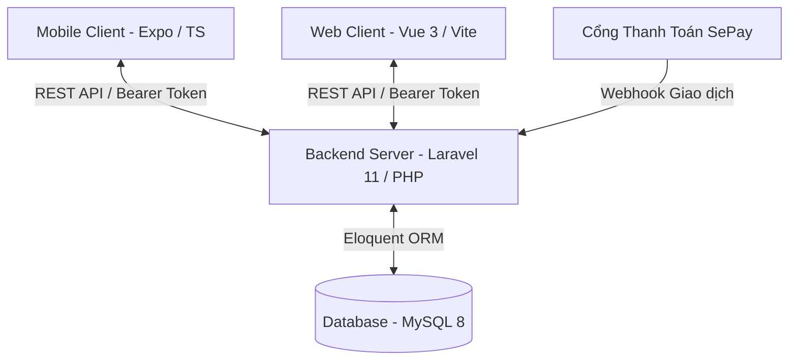

# 🌳 CÂY GIA PHẢ ECOSYSTEM (Gia Phả Số Dòng Họ) 🌳

[](https://laravel.com)
[](https://vuejs.org)
[](https://vitejs.dev)
[-black?style=for-the-badge&logo=expo&logoColor=white)](https://expo.dev)
[](https://mysql.com)
[](https://php.net)
[](https://typescriptlang.org)

> **Hệ sinh thái số hóa Phả hệ, Gia phả và Quản lý di sản dòng họ toàn diện.** 
> Kết hợp công nghệ Web App hiện đại (Vue 3, Laravel) cùng Mobile App di động (React Native/Expo) và thanh toán QR tự động SePay, giúp kết nối thế hệ, lưu giữ cội nguồn và minh bạch hóa đóng góp quỹ dòng họ.

---

## 🧭 Bản đồ Công nghệ & Ngôn ngữ (Tech Stack & Languages)

Dự án được phân rã thành **3 phân hệ cốt lõi** hoạt động đồng bộ qua hệ thống RESTful API bảo mật:



### 1. 🖥️ Web Client (Frontend)
*   **Ngôn ngữ**: JavaScript (ES6+), HTML5, CSS3 (Custom Glassmorphic styles).
*   **Công nghệ**: **Vue.js 3** (SFCs, Composition/Options API), **Vue Router 4** quản lý luồng trang, **Vite** tối ưu bundle siêu tốc.
*   **Thư viện đồ họa**: **Chart.js** & **Vue-Chartjs** vẽ biểu đồ thống kê đóng góp, quỹ, và tăng trưởng thành viên trực quan.
*   **Kiến trúc giao diện**: Tương thích hoàn toàn cả Light/Dark Mode thông qua hệ thống dynamic CSS variables.

### 2. ⚙️ RESTful API (Backend Server)
*   **Ngôn ngữ**: **PHP 8.2+** (Sử dụng chặt chẽ OOP, Type Hinting, và PSR-12 coding standard).
*   **Công nghệ**: **Laravel 11.x**, bảo mật qua **Laravel Sanctum** (Stateful Token authentication).
*   **Quản lý giao dịch tự động**: Tích hợp SDK **SePay Gateway Webhook** để tự động kiểm duyệt & ghi nhận tiền đóng góp tức thì mà không cần đối soát thủ công.
*   **Kiến trúc dữ liệu**: MySQL 8.x chuẩn hóa 3NF, phân tách chi nhánh dòng họ (Branches) kết hợp phân quyền chi tiết (RBAC).

### 3. 📱 Mobile App (Universal Client)
*   **Ngôn ngữ**: **TypeScript (TS)** đảm bảo an toàn kiểu dữ liệu và gợi ý code chính xác.
*   **Công nghệ**: **Expo SDK 56** (chạy trên lõi **React Native** đa nền tảng iOS & Android), **Expo Router** quản lý chuyển trang dựa trên tệp (File-based Routing).
*   **Tính năng bản đồ**: **React Native Maps** dùng để định vị, đánh dấu vị trí các khu mộ tổ và mộ phần dòng họ trên bản đồ vệ tinh thực tế.

---

## ⚡ Các Tính Năng Đột Phá (Core Features)

| Phân hệ | Tính năng nổi bật | Chi tiết trải nghiệm |
| :--- | :--- | :--- |
| **Cây Gia Phả 🌳** | Cây dòng tộc tương tác trực quan | Kết xuất sơ đồ phả hệ dạng cây phân nhánh động (Dynamic Ancestry Tree View). Hỗ trợ kéo thả, thu phóng, xem chi tiết vợ/chồng, con nuôi, và trạng thái sinh tử. |
| **Thanh toán SePay 💳** | Đóng góp & công đức QR tự động | Tự động tạo mã QR động chứa sẵn số tài khoản, số tiền và cú pháp đóng góp. Khi thành viên quét mã chuyển tiền, hệ thống nhận webhook SePay và ghi nhận công đức tự động trong 3 giây. |
| **Bản đồ Mộ Phần 📍** | Định vị mộ phần & Tưởng niệm | Quản lý bản đồ mộ tổ dòng họ thông qua tọa độ GPS địa lý, tích hợp trang tưởng niệm trực tuyến cho người đã khuất (thắp nhang, dâng hoa kỹ thuật số). |
| **Hoạt Động & Sự Kiện 📅**| Lịch giỗ chạp & Thông báo | Lên lịch các sự kiện cúng tổ, họp họ, ghi nhận thành viên đăng ký tham gia, tự động gửi thông báo trực quan tới toàn bộ thành viên. |
| **Phân quyền RBAC 🔐** | Bảo mật đa cấp quản trị | Master Admin (Quản trị hệ thống) -> Partner (Đối tác/Trưởng chi nhánh - sở hữu Master Layout riêng biệt) -> Thành viên dòng họ (Client/Mobile). |

---

## 🛠️ Hướng dẫn Cài đặt & Vận hành (Installation & Setup)

### 📌 Yêu cầu hệ thống tối thiểu
*   **PHP** `>= 8.2` (đã kích hoạt extensions: `pdo_mysql`, `mbstring`, `openssl`, `xml`, `curl`)
*   **Composer** `>= 2.x`
*   **Node.js** `>= 18.x` & **npm** `>= 9.x`
*   **MySQL Server** `>= 8.0` hoặc **MariaDB**
*   **XAMPP / Laragon** chạy môi trường máy chủ cục bộ (local).

---

### 1. ⚙️ Cài đặt Phân hệ Backend (be)

Di chuyển vào thư mục backend và cài đặt các gói phụ thuộc:
```bash
cd be
composer install
```

Tạo tệp cấu hình môi trường `.env`:
```bash
cp .env.example .env
```

Mở tệp `.env` vừa tạo, cập nhật cấu hình kết nối database MySQL của bạn:
```env
DB_CONNECTION=mysql
DB_HOST=127.0.0.1
DB_PORT=3306
DB_DATABASE=cay_gia_pha   # Tên database bạn đã tạo trong phpMyAdmin
DB_USERNAME=root          # Username database mặc định
DB_PASSWORD=              # Password database của bạn
```

Khởi tạo Application Key cho Laravel:
```bash
php artisan key:generate
```

Chạy lệnh Migration để thiết lập bảng cơ sở dữ liệu và nạp dữ liệu mẫu (Seeders):
```bash
php artisan migrate --seed
```

> [!IMPORTANT]
> Lệnh `--seed` ở trên sẽ nạp toàn bộ cấu hình chức năng, phân quyền ban đầu, danh sách các chi nhánh mẫu, và tài khoản quản trị hệ thống mặc định.

Khởi động server backend Laravel:
```bash
php artisan serve
```
*   Server API chạy mặc định tại địa chỉ: `http://127.0.0.1:8000`

---

### 2. 🖥️ Cài đặt Phân hệ Web Frontend (fe)

Di chuyển vào thư mục frontend:
```bash
cd ../fe
```

Cài đặt các thư viện Node.js:
```bash
npm install
```

Khởi chạy máy chủ biên dịch phát triển (Vite Dev Server):
```bash
npm run dev
```
*   Màn hình Web Console sẽ hiển thị link truy cập cục bộ, thường là: `http://localhost:5173`

Để đóng gói mã nguồn sản phẩm khi triển khai production:
```bash
npm run build
```

---

### 3. 📱 Cài đặt Ứng dụng Di động (mobile)

Di chuyển vào thư mục mobile:
```bash
cd ../mobile
```

Cài đặt các gói phụ thuộc tương thích với Expo 56:
```bash
npm install
```

Khởi chạy trình điều phối Expo CLI:
```bash
npx expo start
```
*   Bấm phím `a` để chạy trên Android Emulator (nếu có sẵn Android Studio).
*   Bấm phím `i` để chạy trên iOS Simulator (chỉ dành cho hệ điều hành macOS).
*   Hoặc tải ứng dụng **Expo Go** trên điện thoại thật và quét mã QR hiển thị trên Terminal để trải nghiệm trực tiếp.

---

## 🔒 Cấu hình Cổng Thanh Toán SePay (QR Auto-Donation)

Để tính năng quét mã QR đóng góp và tự động ghi nhận hoạt động chính xác:

1.  **Thiết lập phía Đối tác/Admin**: 
    Đăng nhập vào trang quản trị của Đối tác/Admin họ, chọn **Cấu hình SePay**. Nhập các thông số tài khoản ngân hàng thụ hưởng và `SePay API Token` (lấy từ bảng điều khiển SePay.vn).
2.  **Cấu hình Webhook**:
    Trên bảng cấu hình tài khoản SePay.vn của bạn, hãy trỏ địa chỉ Webhook nhận thông báo giao dịch về link server API:
    `http://<your-public-domain-or-ngrok>/api/sepay/webhook`
3.  **Quy trình đối soát tự động**:
    *   Thành viên nhấn đóng góp -> Hệ thống tạo QR động kèm cú pháp chuyển tiền chứa ID thành viên và chi nhánh (`DONGGOP MEMBER<ID>`).
    *   Hệ thống nhận webhook từ SePay -> Phân tích cú pháp (`noi_dung`) -> Đối chiếu cơ sở dữ liệu -> Chuyển trạng thái giao dịch sang `Đã duyệt` -> Ghi nhận điểm số/tính chất đóng góp tức thì mà không cần duyệt tay.

---

## 📂 Sơ đồ Cấu trúc Dự án (Repository Layout)

```text
CayGiaPha/
├── be/                    # BACKEND CODEBASE (Laravel Framework)
│   ├── app/               # Logic ứng dụng (Controllers, Models, Middleware...)
│   ├── config/            # Tệp cấu hình Laravel
│   ├── database/          # Migrations (Cấu trúc bảng) & Seeders (Dữ liệu mẫu)
│   ├── routes/            # Routes định nghĩa các API Endpoint (api.php)
│   └── composer.json      # Quản lý thư viện PHP dependencies
│
├── fe/                    # WEB CLIENT CODEBASE (Vue 3 / Vite)
│   ├── src/
│   │   ├── components/    # Components chia theo nhóm Admin, Đối Tác, Client, Auth
│   │   ├── layout/        # Master layouts thích ứng Sidebar & Navbar
│   │   ├── router/        # Định tuyến các trang Vue Route
│   │   └── App.vue        # File gốc ứng dụng Vue
│   ├── package.json       # Quản lý Node.js dependencies
│   └── vite.config.js     # Cấu hình bundler Vite
│
└── mobile/                # MOBILE APP CODEBASE (Expo React Native / TypeScript)
    ├── src/               # Code nghiệp vụ Mobile
    ├── assets/            # Hình ảnh, biểu tượng, phông chữ dùng trong App
    ├── app.json           # Tệp cấu hình ứng dụng Expo
    └── tsconfig.json      # Tệp cấu hình dự án TypeScript
```

---

## ✍️ Bản quyền và Phát triển (License & Support)

Dự án thuộc quyền phát triển nội bộ của dòng tộc, mã nguồn mở phân phối theo giấy phép [MIT License](https://opensource.org/licenses/MIT). 

Mọi thắc mắc hoặc yêu cầu bổ sung chức năng, vui lòng mở mục **Issues** trên kho lưu trữ dự án hoặc liên hệ trực tiếp với Ban Quản Trị Hệ Thống Số Hóa Gia Phả.

---
*Chúc bạn có trải nghiệm tuyệt vời cùng Hệ sinh thái Số hóa Gia Phả Dòng Họ!* 🌳
